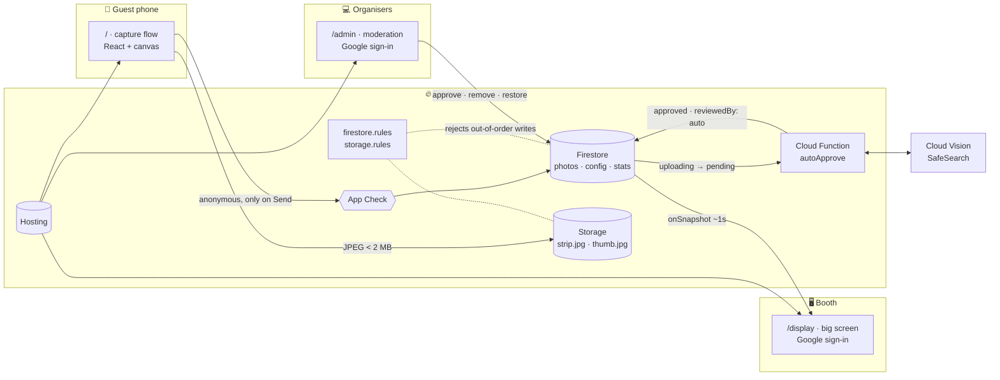
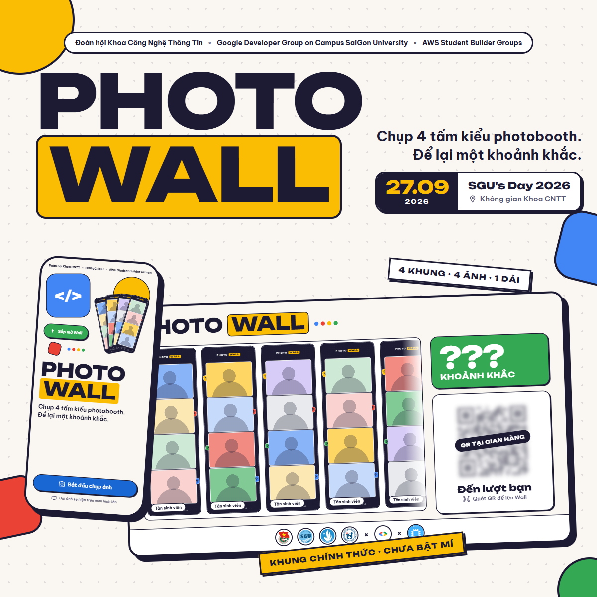
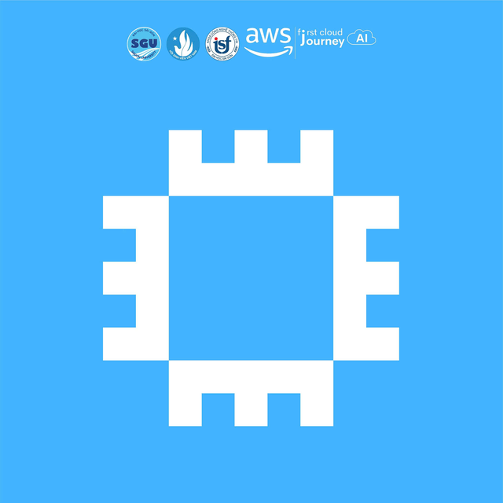

<p align="center">
  <a href="Readme.md">Tiếng Việt</a> · <b>English</b> · <a href="Readme.zh-CN.md">简体中文</a>
</p>

<p align="center">
  
</p>

<p align="center">
  <b>A browser-based photobooth for the SGU's Day 2026 booth.</b><br>
  Guests scan a QR code, take 4 shots on their own phone, place them in an organiser frame,<br>
  and a few seconds later the strip is gliding across the big screen at the booth.
</p>

<p align="center">
  
  
  
  
  
</p>

<p align="center">
  <a href="#-2709-in-numbers">Numbers</a> ·
  <a href="#-the-guest-journey">Guest flow</a> ·
  <a href="#-the-big-screen">Big screen</a> ·
  <a href="#-moderation-console">Moderation</a> ·
  <a href="#-photobooth-frames">Frames</a> ·
  <a href="#-architecture">Architecture</a> ·
  <a href="#-run-it-locally">Run it</a>
</p>

---

## 📊 27/09 in numbers

Photo Wall ran for the whole of **SGU's Day 2026** in the Faculty of IT space at Saigon University. The team operated no servers of its own; the entire day's load fit inside Firebase:

<table>
  <tr>
    <td align="center" width="20%"><h2>948 MB</h2><sub>Hosting downloads<br>(7 days, concentrated on event day)</sub></td>
    <td align="center" width="20%"><h2>27K</h2><sub>Firestore reads<br>(big screen + console)</sub></td>
    <td align="center" width="20%"><h2>3.8K</h2><sub>Firestore writes<br>(submit, approve, remove)</sub></td>
    <td align="center" width="20%"><h2>1.6K</h2><sub>Cloud Functions invocations<br>(autoApprove trigger)</sub></td>
    <td align="center" width="20%"><h2>13.2 MB</h2><sub>Cloud Storage<br>(strips + thumbnails)</sub></td>
  </tr>
</table>

<p align="center">
  
  <br><sub>The Build dashboard in the Firebase console, captured after the event. Every line sits near zero all week, then jumps on event day.</sub>
</p>

> [!NOTE]
> The whole product, from design to production, was built in **5 days (22 → 26/09)** across **113 commits**, and went live on 27/09.

---

## 📸 The guest journey

Design goal: **from scanning the QR code to appearing on the Wall, a median of ≤ 45 seconds.** Every screen answers a single question: *what do I do next?*

<p align="center">
  
  <br><sub>Captured from the running app (mock backend, fake camera), following the route order in <a href="frontend/src/apps/mobile/App.tsx">App.tsx</a>. The product UI is in Vietnamese.</sub>
</p>

| Step | Route | What the guest does | Worth noting |
|:---:|---|---|---|
| **S01** | `/` | Scans the QR code, taps *Bắt đầu chụp ảnh* ("Start shooting") | No app to install, no sign-in. |
| **S02** | `/name` | Enters a name (1–24 characters) and consents to display | Turning off *"Hiện tên trên màn hình lớn"* ("Show my name on the big screen") shows "Tân sinh viên" ("New student") instead. |
| **S03** | `/camera/:n` | Takes shot *n* of 4 | 3 s timer on by default. Camera switches fade; the preview mirrors automatically for front vs. back camera. Gallery upload if the organisers allow it. |
| **S04** | `/camera/:n/review` | Keeps the shot or retakes it | S03 ↔ S04 loop until all 4 shots are in. |
| **S05** | `/finish` | Chooses a frame and reviews the whole strip, on one screen | Tap a card to swap the frame right on the preview; tap a slot to retake just that shot. |
| **S06** | `/upload` | Waits for the upload | *Cancel* and *Back* are hidden while uploading; after 45 s it reports an error instead of hanging. |
| **S07b → S07** | `/done` | Waits for review, then *"Bạn đã lên Wall!"* ("You're on the Wall!") | The same screen upgrades in place when an organiser taps *Approve*. The guest gets a *Moment #N* number and can download, share or remove their strip. |

The phone deliberately has **no** Wall view and no "my strip" screen: the Wall only plays on the big screen, and everything a guest can do with a submitted strip lives on `/done`.

<p align="center">
  
</p>

- **E01 · Camera not allowed:** explains how to re-enable camera access, or use the *Gallery* if the organisers allow it.
- **E02 · Upload failed:** all 4 shots are kept; *Retry* resends the exact strip that was in flight.
- **E03 · Submissions closed:** when organisers pause submissions or the auto-close time passes, a guest mid-flow is moved to `/closed` at that moment.

What guests never see, but keeps the flow from breaking:

- **No screen ever scrolls.** `npm run check:fit` opens Chrome with a fake camera, walks the whole flow at **11 viewports** and measures every screen; anything over budget fails.
- **Shots survive leaving the page.** Accepted shots live in IndexedDB; coming back within 30 minutes offers *"Tiếp tục bộ đang chụp?"* ("Continue your set?").
- **A dropped connection costs no attempt.** The photo's slot is already reserved; *Retry* only re-uploads the file.
- **The preview is exactly the downloaded image.** The DOM preview and the JPEG-exporting canvas read the same slot coordinates from `frames.json`.
- **Anonymous sign-in only on Send.** Campus Wi-Fi puts hundreds of phones behind one IP, so someone who opens the page and leaves must not use up an account.

---

## 🖥️ The big screen

A 1920 × 1080 display at the booth. No polling: an approved strip appears within about a second.

<p align="center">
  
  <br><sub><b>D02</b> · A strip was just approved: the <i>"Vừa lên Wall!"</i> ("Just on the Wall!") card slides up and the counter ticks +1.</sub>
</p>

<details>
<summary><b>D01 · Idle state</b> (click to expand)</summary>
<br>
<p align="center"></p>
</details>

- **A conveyor, not a marquee.** The familiar `translateX(-50%)` loop jolts the whole row whenever a strip is added or removed. [conveyor.ts](frontend/src/features/display/conveyor.ts) places strips into slots on a steadily moving belt; a new strip slides in with a gentle shift.
- **A bounded card queue.** Each card holds the screen for 6.3 s. At most 3 cards wait; beyond that they merge into one *"+N new strips"* card, so approving 10 in a row does not turn into a minute of cards.
- **Organisers only.** `/display` sits behind the same Google sign-in as the console. Only accounts on the moderator allowlist see the Wall; a guest who scans the URL by mistake only sees the sign-in screen. The session survives the kiosk's own reloads.
- **Self-maintaining.** Firestore listeners resubscribe when a stream errors. The kiosk reloads itself every 6 hours, only when online. An admin tapping *"Làm mới màn lớn"* ("Refresh big screen") reloads every open screen at once.

---

## 🛡️ Moderation console

Runs at `/admin` with Google sign-in; only allowlisted emails get in.

<p align="center">
  
</p>

| Role | Who | Can do |
|---|---|---|
| `moderator` | Faculty of IT Youth Union & Student Association · AWS Student Builder Groups | Approve, remove, restore photos; view every tab |
| `admin` | GDGoC | Everything above, plus: open/close submissions, auto-close time, enable/disable frames, add/remove moderators, export data, schedule deletion |

- **`A` / `R` / `↑↓` shortcuts** for fast review, plus multi-select to approve or remove in bulk. The target is under 3 minutes per photo; past 3 minutes the wait time turns red.
- **Auto-approval with Cloud Vision SafeSearch.** The `autoApprove` function rates `adult · violence · racy`; any strip at or above the threshold stays in *Pending* with its ratings shown to the moderator.
- **Removing takes a strip off the big screen immediately**, but the file is kept for 24 hours so it can still be restored.
- **After the event:** download every strip as a `.zip`, export a CSV, and build a **timelapse video right in the browser** with `MediaRecorder` (or `npm run timelapse` with FFmpeg).

---

## 🖼️ Photobooth frames

One component, one template. Every frame is a **1080 × 3400** canvas with 4 photo slots.

<p align="center">
  
</p>

A new frame needs just **1 overlay file** in [frontend/public/frames/](frontend/public/frames/) and **1 entry** in [frames.json](frontend/public/frames/frames.json):

```jsonc
{
  "id": "f01-gdgoc",                  // must match /^f[0-9]{2}-[a-z0-9-]{1,30}$/ in the rules
  "label": "Khung 01",
  "title": "GDGoC · Build Together",
  "overlay": "frame-f01-gdgoc.webp",  // 1080×3400 PNG/WebP with alpha, drawn on top
  "slots": [[171, 338, 735, 549], /* … 4 slots [x, y, w, h] */],
  "r": 36                             // slot corner radius
}
```

The export is a JPEG at quality 0.82 (fallback 0.75), targeting ≤ 600 KB with a hard 2 MB ceiling. A 480px thumbnail goes along for the big screen and the console, about 60–90 KB instead of ~600 KB.

---

## 🏗️ Architecture

**The team runs no servers.** Every rule (who may submit, how often, who may approve) lives in Firebase security rules. The one server-side piece is a Cloud Function doing the job a browser cannot be trusted with: approving photos automatically.



A strip's lifecycle:

```
uploading ──► pending ──┬──► approved ──► removed   (by organisers, or by the guest)
                        └──► rejected
```

Rules enforced by the security rules, not by the UI:

| Rule | Value |
|---|---|
| Interval between two submissions | 60 seconds |
| Strips per guest | 3 (admin-adjustable, up to 20) |
| Image size | < 2 MB (thumbnail < 300 KB), JPEG only |
| Display name | 1–24 characters after `trim()` |
| Submission window | `uploadsOpen` + `closesAt` |
| Removed photos kept for | 24 hours (up to 168) |
| Requests without an App Check token | Rejected |

The frontend never calls `setDoc` or `uploadBytes` directly. Everything goes through [backend/src/client.ts](backend/src/client.ts), because the rules only accept the exact write sequence those functions perform.

---

## 🧰 Tech stack

| Layer | What |
|---|---|
| **Frontend** | React 19 · Vite 7 · TypeScript · React Router 7 · CSS Modules · design tokens in [tokens.css](frontend/src/styles/tokens.css) |
| **Fonts** | Unbounded (display) · Be Vietnam Pro (body) |
| **Backend** | Firebase Auth (anonymous + Google) · Firestore · Cloud Storage · App Check · Hosting |
| **Server** | Cloud Functions v2 (Node 22) · Google Cloud Vision SafeSearch |
| **Testing** | Vitest + `@firebase/rules-unit-testing` (100+ security rules cases) · e2e on the emulator · 800-phone load test · `check:fit` with Playwright |
| **Design** | 33 artboards: design system, 12 mobile screens, big screen, console, frames, handoff |

---

## 📁 Repository layout

```
PhotoWall-GDGoCxAWS/
├── frontend/                 Three web apps, one Hosting target
│   ├── index.html            /          guest flow on the phone
│   ├── display/index.html    /display/  big screen (kiosk)
│   ├── admin/index.html      /admin/    moderation console
│   ├── public/frames/        frame overlays + frames.json
│   ├── src/
│   │   ├── pages/            one per screen: Welcome, CameraPage, ShotReview, Finish, Display, ModQueue…
│   │   ├── features/         capture · frames · submit · display · moderation
│   │   ├── components/       Button, Field, Steps, Dialog… from the design system
│   │   └── lib/backend/      adapter: mock (runs without Firebase) or firebase
│   └── tools/fit/            the "no screen scrolls" check
├── backend/
│   ├── src/client.ts         every Firebase read/write, shared by all 3 apps
│   ├── src/schema.ts         the data contract, mirrored by the rules
│   ├── firestore.rules       ◄ this is the real "backend"
│   ├── storage.rules
│   ├── tests/                rules tests on the emulator
│   └── scripts/              seed · e2e · load-test · timelapse
├── functions/                autoApprove + SafeSearch
└── .github/readme/           images for the README
```

---

## 🚀 Run it locally

You need **Node 22+**, the **Firebase CLI** (`npm i -g firebase-tools`), and Chrome or Edge to run `check:fit`.

### 1 · UI only, no Firebase

The in-memory mock backend is the development default and is enough to walk all three apps.

```bash
cd frontend
npm install
npm run dev
```

Open `http://localhost:5173/`, `/display/` and `/admin/`.

### 2 · With the Firebase Emulator

```bash
# Terminal 1
cd backend && npm install
npm run emulators

# Terminal 2: seed the config and grant your email moderator access
cd backend && npm run seed -- you@gmail.com

# Terminal 3
cd frontend
cp .env.example .env.local          # set VITE_BACKEND=firebase, VITE_EMULATORS=1
npm run dev
```

The Emulator UI is at `http://localhost:4000`. Google sign-in in the emulator shows a fake popup; enter the email you seeded to become a moderator.

### 3 · Tests

```bash
cd backend
npm test              # Firestore + Storage security rules
npm run e2e           # phones, big screen and 2 moderators, live on the emulator
npm run load-test     # 800 phones, 3 moderators, 1 big screen

cd ../functions && npm test        # SafeSearch threshold logic
cd ../frontend  && npm run check:fit   # screen overflow at 11 viewports
```

### 4 · Deploy

```bash
npm --prefix frontend run build
firebase deploy --project prod
```

> [!IMPORTANT]
> App Check blocks `localhost` on the real project. To try real data from a dev machine, set `self.FIREBASE_APPCHECK_DEBUG_TOKEN = true` before `initBackend()`, then add the debug token printed in the console under *App Check → Manage debug tokens*.

---

## 🎨 Design

The mobile, big screen and console screens in this README come from the project's UI/UX design. The frames are rendered from the actual overlays and `frames.json` in use. The overall style: minimal, a warm cream ground, 2px ink outlines, hard offset shadows, the four Google colours.

| Group | Contents |
|---|---|
| 01 · Design system | Tokens, controls, patterns. Implemented in [tokens.css](frontend/src/styles/tokens.css) and [components/](frontend/src/components/) |
| 02 · Mobile flow | 12 screens at 390 × 844: S01–S07b and E01–E03 |
| 03 · Big screen & console | D01–D02 big screen · M00 sign-in · M01 moderation · M02 event settings |
| 04 · Frames | The 1080 × 3400 strip spec and the `PhotoWallFrame` template |
| 05 · Handoff | Motion · responsive · a11y · roles · logic review |

<details>
<summary><b>Pre-event teaser banner</b></summary>
<br>
<p align="center"></p>
</details>

---

## 🤝 Organisers & team

<p align="center">
  &nbsp;&nbsp;
  &nbsp;&nbsp;
  &nbsp;&nbsp;
  &nbsp;&nbsp;
  &nbsp;&nbsp;
  
</p>

<p align="center">
  <b>Faculty of IT Youth Union & Student Association</b> × <b>Google Developer Group on Campus · Saigon University</b> × <b>AWS Student Builder Groups</b>
</p>

| | Responsible for |
|---|---|
| **[Nguyễn Minh Triết](https://github.com/MinhTrietNg)** | Project Manager · Frontend: guest flow, big screen, moderation console, frames |
| **Nguyễn Hoàng Khả** | Backend: Firebase, security rules, SafeSearch auto-approval, load test |
| **Nguyễn Ngọc Thu Ngân** | Admin console |

<p align="center">
  <sub>Made for <b>SGU's Day 2026</b> · 27.09.2026 · Faculty of IT, Saigon University</sub><br>
  <sub>Four photobooth shots. One moment to keep. 📸</sub>
</p>
