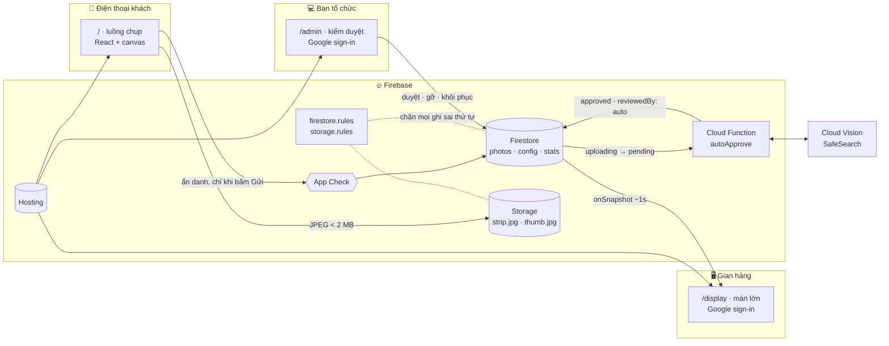

<p align="center">
  
</p>

<p align="center">
  <b>Photobooth chạy trên trình duyệt cho gian hàng SGU's Day 2026.</b><br>
  Khách quét QR, chụp 4 tấm bằng chính điện thoại của mình, ghép vào khung của ban tổ chức,<br>
  và vài giây sau dải ảnh đã trôi trên màn hình lớn tại gian hàng.
</p>

<p align="center">
  
  
  
  
  
</p>

<p align="center">
  <a href="#-ngày-2709--những-con-số">Con số</a> ·
  <a href="#-hành-trình-của-khách">Luồng khách</a> ·
  <a href="#-màn-hình-lớn">Màn hình lớn</a> ·
  <a href="#-console-kiểm-duyệt">Kiểm duyệt</a> ·
  <a href="#-bộ-khung-photobooth">Bộ khung</a> ·
  <a href="#-kiến-trúc">Kiến trúc</a> ·
  <a href="#-chạy-ở-máy-của-bạn">Chạy thử</a>
</p>

---

## 📊 Ngày 27/09 — những con số

Photo Wall chạy trọn ngày hội **SGU's Day 2026** tại không gian Khoa CNTT, Đại học Sài Gòn. Toàn bộ hệ thống không có máy chủ nào do nhóm tự vận hành. Tải của cả ngày nằm gọn trong Firebase:

<table>
  <tr>
    <td align="center" width="20%"><h2>948 MB</h2><sub>Hosting tải xuống<br>(7 ngày, dồn vào ngày hội)</sub></td>
    <td align="center" width="20%"><h2>27K</h2><sub>Lượt đọc Firestore<br>(màn lớn + console)</sub></td>
    <td align="center" width="20%"><h2>3.8K</h2><sub>Lượt ghi Firestore<br>(gửi ảnh, duyệt, gỡ)</sub></td>
    <td align="center" width="20%"><h2>1.6K</h2><sub>Lượt gọi Cloud Functions<br>(trigger autoApprove)</sub></td>
    <td align="center" width="20%"><h2>13.2 MB</h2><sub>Cloud Storage<br>(dải ảnh + thumbnail)</sub></td>
  </tr>
</table>

<p align="center">
  
  <br><sub>Bảng Build trong Firebase console, chụp sau ngày hội. Các đường đều nằm sát 0 suốt tuần, rồi vọt lên đúng ngày sự kiện.</sub>
</p>

> [!NOTE]
> Toàn bộ sản phẩm, từ thiết kế đến bản chạy thật, được làm trong **5 ngày (22 → 26/09)** với **113 commit**, và lên sóng ngày 27/09.

---

## 📸 Hành trình của khách

Mục tiêu thiết kế: **từ lúc quét QR đến lúc lên Wall, trung vị ≤ 45 giây.** Mỗi màn chỉ trả lời một câu hỏi: *tiếp theo mình làm gì?*

<p align="center">
  
  <br><sub>Chụp từ chính app đang chạy (backend mock, camera giả), đi đúng thứ tự route trong <a href="frontend/src/apps/mobile/App.tsx">App.tsx</a>.</sub>
</p>

| Bước | Route | Khách làm gì | Chi tiết đáng chú ý |
|:---:|---|---|---|
| **S01** | `/` | Quét QR, bấm *Bắt đầu chụp ảnh* | Không cài app, không đăng nhập. |
| **S02** | `/name` | Nhập tên (1–24 ký tự), đồng ý hiển thị | Tắt *"Hiện tên trên màn hình lớn"* thì Wall ghi "Tân sinh viên". |
| **S03** | `/camera/:n` | Chụp tấm *n* / 4 | Hẹn giờ 3s bật sẵn. Đổi camera mờ dần, tự lật hình theo camera trước/sau. Chọn từ thư viện nếu BTC cho phép. |
| **S04** | `/camera/:n/review` | Giữ tấm vừa chụp hoặc chụp lại | S03 ↔ S04 lặp đủ 4 tấm. |
| **S05** | `/finish` | Chọn khung và xem lại cả dải, trên cùng một màn | Bấm thẻ để đổi khung ngay trên bản xem trước; chạm một ô để chụp lại riêng ô đó. |
| **S06** | `/upload` | Chờ gửi | Ẩn *Huỷ* và *Quay lại* khi đang tải lên; quá 45 giây thì báo lỗi thay vì treo. |
| **S07b → S07** | `/done` | Chờ duyệt, rồi *"Bạn đã lên Wall!"* | Cùng một màn tự chuyển khi BTC bấm *Duyệt*. Nhận số *Khoảnh khắc #N*, tải dải ảnh về, chia sẻ, hoặc tự gỡ. |

Điện thoại cố ý **không có** màn xem Wall và màn "dải ảnh của tôi": Wall chỉ chiếu trên màn hình lớn, còn mọi thao tác với dải ảnh đã gửi nằm ngay ở `/done`.

<p align="center">
  
</p>

- **E01 · Chưa cho phép camera:** hướng dẫn mở lại quyền camera, hoặc dùng *Thư viện* nếu BTC cho phép.
- **E02 · Gửi chưa thành công:** 4 tấm vẫn còn; *Gửi lại* dùng đúng dải ảnh đang gửi dở.
- **E03 · Đã đóng nhận ảnh:** khi BTC tạm dừng hoặc tới giờ tự đóng, khách đang chụp dở được chuyển sang `/closed` ngay lúc đó.

Những thứ khách không thấy nhưng giữ cho luồng không vỡ:

- **Không màn nào phải cuộn.** `npm run check:fit` mở Chrome với camera giả, đi trọn luồng ở **11 viewport** và đo từng màn, vượt ngân sách là đỏ.
- **Ảnh không mất khi rời trang.** Các tấm đã chụp nằm trong IndexedDB; quay lại trong 30 phút sẽ được hỏi *"Tiếp tục bộ đang chụp?"*.
- **Mạng rớt giữa chừng không tốn lượt.** Chỗ của ảnh đã được giữ; nút *Gửi lại* chỉ tải tiếp file.
- **Xem trước đúng là ảnh sẽ tải về.** Bản xem trước trên DOM và canvas xuất JPEG đọc cùng toạ độ ô từ `frames.json`.
- **Đăng nhập ẩn danh chỉ khi bấm Gửi.** Wifi trường cho hàng trăm máy dùng chung một IP, nên người mở trang rồi bỏ đi không được tốn một tài khoản.

---

## 🖥️ Màn hình lớn

Màn 1920 × 1080 đặt tại gian hàng. Không polling: ảnh được duyệt xuất hiện trong khoảng một giây.

<p align="center">
  
  <br><sub><b>D02</b> · Một dải vừa được duyệt: thẻ <i>"Vừa lên Wall!"</i> trượt lên, bộ đếm nhảy +1.</sub>
</p>

<details>
<summary><b>D01 · Trạng thái thường</b> (bấm để xem)</summary>
<br>
<p align="center"></p>
</details>

- **Băng chuyền, không phải marquee.** Kiểu `translateX(-50%)` quen thuộc sẽ giật cả hàng mỗi khi thêm hoặc gỡ một dải. [conveyor.ts](frontend/src/features/display/conveyor.ts) đặt các dải vào từng ô trên một băng chạy đều; dải mới chen vào bằng một cú dịch mềm.
- **Hàng đợi thẻ có giới hạn.** Mỗi thẻ giữ màn 6,3 giây. Tối đa 3 thẻ chờ; nhiều hơn thì gộp thành một thẻ *"+N dải ảnh mới"*, nên duyệt dồn 10 ảnh không kéo dài thành một phút.
- **Chỉ BTC mở được.** `/display` đứng sau cùng lớp đăng nhập Google với console. Chỉ tài khoản có trong danh sách kiểm duyệt mới thấy Wall; khách lỡ quét nhầm URL chỉ thấy màn đăng nhập. Phiên đăng nhập vẫn giữ qua các lần kiosk tự tải lại.
- **Tự chăm sóc.** Listener Firestore tự nối lại khi luồng bị lỗi. Kiosk tự tải lại mỗi 6 giờ, và chỉ khi có mạng. Admin bấm *"Làm mới màn lớn"* là mọi màn đang mở cùng tải lại.

---

## 🛡️ Console kiểm duyệt

Chạy ở `/admin`, đăng nhập Google, chỉ email có trong danh sách mới vào được.

<p align="center">
  
</p>

| Vai trò | Ai | Được làm |
|---|---|---|
| `moderator` | Đoàn hội Khoa CNTT · AWS Student Builder Groups | Duyệt, gỡ, khôi phục ảnh; xem mọi tab |
| `admin` | GDGoC | Tất cả quyền trên, cộng: mở/đóng nhận ảnh, giờ tự đóng, bật/tắt khung, thêm/gỡ người duyệt, xuất dữ liệu, lên lịch xoá |

- **Phím tắt `A` / `R` / `↑↓`** để duyệt nhanh, cùng chọn nhiều để duyệt hoặc gỡ hàng loạt. Mục tiêu dưới 3 phút cho mỗi ảnh; quá 3 phút thì thời gian chờ chuyển đỏ.
- **Tự động duyệt bằng Cloud Vision SafeSearch.** Hàm `autoApprove` chấm `adult · violence · racy`; dải nào chạm ngưỡng thì ở lại *Chờ duyệt* kèm điểm cho người duyệt xem.
- **Gỡ là mất khỏi màn lớn ngay**, nhưng file giữ 24 giờ để còn khôi phục.
- **Sau sự kiện:** tải toàn bộ dải ảnh thành `.zip`, xuất CSV, và dựng **video timelapse ngay trong trình duyệt** bằng `MediaRecorder` (hoặc `npm run timelapse` với FFmpeg).

---

## 🖼️ Bộ khung photobooth

Một component, một template. Mọi khung đều là canvas **1080 × 3400** với 4 ô ảnh.

<p align="center">
  
</p>

Thêm khung mới chỉ cần **1 file overlay** trong [frontend/public/frames/](frontend/public/frames/) và **1 dòng** trong [frames.json](frontend/public/frames/frames.json):

```jsonc
{
  "id": "f01-gdgoc",                  // khớp /^f[0-9]{2}-[a-z0-9-]{1,30}$/ trong rules
  "label": "Khung 01",
  "title": "GDGoC · Build Together",
  "overlay": "frame-f01-gdgoc.webp",  // PNG/WebP alpha 1080×3400, vẽ đè lên cùng
  "slots": [[171, 338, 735, 549], /* … 4 ô [x, y, w, h] */],
  "r": 36                             // bo góc ô ảnh
}
```

Ảnh xuất ra là JPEG chất lượng 0.82 (dự phòng 0.75), mục tiêu ≤ 600 KB, trần cứng 2 MB. Kèm một thumbnail 480px cho màn lớn và console, khoảng 60–90 KB thay vì ~600 KB.

---

## 🏗️ Kiến trúc

**Không có server nào do nhóm vận hành.** Mọi quy tắc (ai được gửi, gửi bao lâu một lần, ai được duyệt) nằm trong Firebase security rules. Server duy nhất là một Cloud Function làm việc mà trình duyệt không thể được tin: tự duyệt ảnh.



Vòng đời một dải ảnh:

```
uploading ──► pending ──┬──► approved ──► removed   (BTC gỡ, hoặc khách tự gỡ)
                        └──► rejected
```

Những luật mà rules thực thi, không phải giao diện:

| Luật | Giá trị |
|---|---|
| Khoảng cách giữa hai lần gửi | 60 giây |
| Số dải mỗi khách | 3 (admin chỉnh được, tối đa 20) |
| Kích thước ảnh | < 2 MB (thumbnail < 300 KB), chỉ nhận JPEG |
| Tên hiển thị | 1–24 ký tự sau khi `trim()` |
| Giờ đóng nhận ảnh | `uploadsOpen` + `closesAt` |
| Giữ ảnh đã gỡ | 24 giờ (tối đa 168) |
| Request không có token App Check | Bị chặn |

Frontend không bao giờ gọi `setDoc` hay `uploadBytes` trực tiếp. Mọi thao tác đi qua [backend/src/client.ts](backend/src/client.ts), vì rules chỉ chấp nhận đúng thứ tự ghi mà các hàm đó thực hiện.

---

## 🧰 Công nghệ

| Lớp | Dùng gì |
|---|---|
| **Frontend** | React 19 · Vite 7 · TypeScript · React Router 7 · CSS Modules · design token trong [tokens.css](frontend/src/styles/tokens.css) |
| **Font** | Unbounded (display) · Be Vietnam Pro (body) |
| **Backend** | Firebase Auth (ẩn danh + Google) · Firestore · Cloud Storage · App Check · Hosting |
| **Server** | Cloud Functions v2 (Node 22) · Google Cloud Vision SafeSearch |
| **Kiểm thử** | Vitest + `@firebase/rules-unit-testing` (100+ ca cho security rules) · e2e trên emulator · load test 800 điện thoại · `check:fit` bằng Playwright |
| **Thiết kế** | 33 artboard: design system, 12 màn mobile, màn lớn, console, bộ khung, handoff |

---

## 📁 Cấu trúc repo

```
PhotoWall-GDGoCxAWS/
├── frontend/                 Ba web app, một Hosting target
│   ├── index.html            /          luồng khách trên điện thoại
│   ├── display/index.html    /display/  màn hình lớn (kiosk)
│   ├── admin/index.html      /admin/    console kiểm duyệt
│   ├── public/frames/        overlay khung + frames.json
│   ├── src/
│   │   ├── pages/            từng màn: Welcome, CameraPage, ShotReview, Finish, Display, ModQueue…
│   │   ├── features/         capture · frames · submit · display · moderation
│   │   ├── components/       Button, Field, Steps, Dialog… theo design system
│   │   └── lib/backend/      adapter: mock (chạy không cần Firebase) hoặc firebase
│   └── tools/fit/            kiểm tra "không màn nào phải cuộn"
├── backend/
│   ├── src/client.ts         mọi thao tác đọc/ghi Firebase, dùng chung cho 3 app
│   ├── src/schema.ts         hợp đồng dữ liệu, trùng khớp với rules
│   ├── firestore.rules       ◄ đây mới là "backend"
│   ├── storage.rules
│   ├── tests/                kiểm thử rules trên emulator
│   └── scripts/              seed · e2e · load-test · timelapse
├── functions/                autoApprove + SafeSearch
└── .github/readme/           ảnh minh hoạ cho README
```

---

## 🚀 Chạy ở máy của bạn

Cần **Node 22+**, **Firebase CLI** (`npm i -g firebase-tools`), và Chrome hoặc Edge nếu muốn chạy `check:fit`.

### 1 · Chỉ giao diện, không cần Firebase

Backend mock trong bộ nhớ là mặc định khi dev, đủ để đi trọn cả ba app.

```bash
cd frontend
npm install
npm run dev
```

Mở `http://localhost:5173/`, `/display/` và `/admin/`.

### 2 · Với Firebase Emulator

```bash
# Terminal 1
cd backend && npm install
npm run emulators

# Terminal 2: tạo cấu hình mẫu và cấp quyền duyệt cho email của bạn
cd backend && npm run seed -- ban@gmail.com

# Terminal 3
cd frontend
cp .env.example .env.local          # đặt VITE_BACKEND=firebase, VITE_EMULATORS=1
npm run dev
```

Emulator UI ở `http://localhost:4000`. Đăng nhập Google trong emulator hiện popup giả; nhập đúng email đã seed là thành người duyệt.

### 3 · Kiểm thử

```bash
cd backend
npm test              # security rules của Firestore + Storage
npm run e2e           # điện thoại, màn lớn và 2 người duyệt chạy thật trên emulator
npm run load-test     # 800 điện thoại, 3 người duyệt, 1 màn lớn

cd ../functions && npm test        # logic ngưỡng SafeSearch
cd ../frontend  && npm run check:fit   # đo tràn màn ở 11 viewport
```

### 4 · Triển khai

```bash
npm --prefix frontend run build
firebase deploy --project prod
```

> [!IMPORTANT]
> App Check chặn `localhost` trên project thật. Muốn thử với dữ liệu thật từ máy dev, đặt `self.FIREBASE_APPCHECK_DEBUG_TOKEN = true` trước `initBackend()`, rồi thêm debug token in ra ở console vào *App Check → Manage debug tokens*.

---

## 🎨 Thiết kế

Các màn mobile, màn hình lớn và console trong README này lấy từ bộ thiết kế UI/UX của dự án. Bộ khung được dựng từ đúng overlay và `frames.json` đang chạy. Phong cách chung: tối giản, nền kem ấm, viền mực 2px, bóng đổ cứng, bốn màu Google.

| Nhóm | Nội dung |
|---|---|
| 01 · Design system | Token, control, pattern. Bản code nằm ở [tokens.css](frontend/src/styles/tokens.css) và [components/](frontend/src/components/) |
| 02 · Mobile flow | 12 màn 390 × 844: S01–S07b và E01–E03 |
| 03 · Màn lớn & console | D01–D02 màn hình lớn · M00 đăng nhập · M01 kiểm duyệt · M02 cài đặt sự kiện |
| 04 · Khung | Đặc tả dải 1080 × 3400 và template `PhotoWallFrame` |
| 05 · Bàn giao | Motion · responsive · a11y · phân quyền · phản biện logic |

<details>
<summary><b>Banner teaser trước sự kiện</b></summary>
<br>
<p align="center"></p>
</details>

---

## 🤝 Đơn vị & đội ngũ

<p align="center">
  &nbsp;&nbsp;
  &nbsp;&nbsp;
  &nbsp;&nbsp;
  &nbsp;&nbsp;
  &nbsp;&nbsp;
  
</p>

<p align="center">
  <b>Đoàn hội Khoa Công nghệ Thông tin</b> × <b>Google Developer Group on Campus · Saigon University</b> × <b>AWS Student Builder Groups</b>
</p>

| | Phụ trách |
|---|---|
| **[Nguyễn Minh Triết](https://github.com/MinhTrietNg)** | Project Manager · Frontend: luồng khách, màn hình lớn, console kiểm duyệt, bộ khung |
| **Nguyễn Hoàng Khả** | Backend: Firebase, security rules, tự duyệt SafeSearch, load test |
| **Nguyễn Ngọc Thu Ngân** | Console admin |

<p align="center">
  <sub>Làm cho <b>SGU's Day 2026</b> · 27.09.2026 · Khoa CNTT, Đại học Sài Gòn</sub><br>
  <sub>Chụp 4 tấm kiểu photobooth. Để lại một khoảnh khắc. 📸</sub>
</p>
