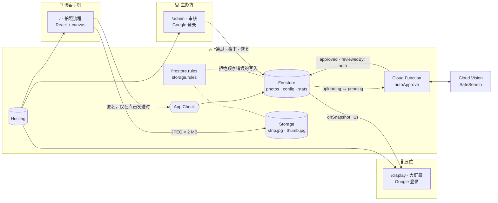

<p align="center">
  <a href="Readme.md">Tiếng Việt</a> · <a href="Readme.en.md">English</a> · <b>简体中文</b>
</p>

<p align="center">
  
</p>

<p align="center">
  <b>为 SGU's Day 2026 展位打造的浏览器拍照亭。</b><br>
  访客扫描二维码，用自己的手机拍 4 张照片，放进主办方设计的相框，<br>
  几秒钟后，这条照片条就在展位的大屏幕上滑过。
</p>

<p align="center">
  
  
  
  
  
</p>

<p align="center">
  <a href="#-9月27日当天的数据">数据</a> ·
  <a href="#-访客流程">访客流程</a> ·
  <a href="#-大屏幕">大屏幕</a> ·
  <a href="#-审核后台">审核</a> ·
  <a href="#-拍照相框">相框</a> ·
  <a href="#-架构">架构</a> ·
  <a href="#-本地运行">本地运行</a>
</p>

---

## 📊 9月27日当天的数据

Photo Wall 在西贡大学信息技术学院场地运行了 **SGU's Day 2026** 全天。团队没有自己运维任何服务器，一整天的负载全部由 Firebase 承担：

<table>
  <tr>
    <td align="center" width="20%"><h2>948 MB</h2><sub>Hosting 下载量<br>（7 天，集中在活动当天）</sub></td>
    <td align="center" width="20%"><h2>27K</h2><sub>Firestore 读取<br>（大屏幕 + 后台）</sub></td>
    <td align="center" width="20%"><h2>3.8K</h2><sub>Firestore 写入<br>（提交、通过、撤下）</sub></td>
    <td align="center" width="20%"><h2>1.6K</h2><sub>Cloud Functions 调用<br>（autoApprove 触发）</sub></td>
    <td align="center" width="20%"><h2>13.2 MB</h2><sub>Cloud Storage<br>（照片条 + 缩略图）</sub></td>
  </tr>
</table>

<p align="center">
  
  <br><sub>活动结束后截取的 Firebase 控制台 Build 面板。整周曲线都贴近 0，直到活动当天陡然上升。</sub>
</p>

> [!NOTE]
> 从设计到正式上线，整个产品在 **5 天内（9月22日 → 26日）** 完成，共 **113 次提交**，并于 9月27日上线。

---

## 📸 访客流程

设计目标：**从扫码到登上 Wall，中位数 ≤ 45 秒。** 每个页面只回答一个问题：*下一步我该做什么？*

<p align="center">
  
  <br><sub>截取自正在运行的应用（mock 后端、虚拟摄像头），按 <a href="frontend/src/apps/mobile/App.tsx">App.tsx</a> 中的路由顺序走完。产品界面为越南语。</sub>
</p>

| 步骤 | 路由 | 访客操作 | 值得注意 |
|:---:|---|---|---|
| **S01** | `/` | 扫码，点击 *Bắt đầu chụp ảnh*（开始拍照） | 无需安装应用，无需登录。 |
| **S02** | `/name` | 输入姓名（1–24 个字符），同意展示 | 关闭 *"Hiện tên trên màn hình lớn"*（在大屏幕上显示姓名）后，Wall 上显示 "Tân sinh viên"（新生）。 |
| **S03** | `/camera/:n` | 拍摄第 *n* / 4 张 | 默认开启 3 秒倒计时。切换摄像头时渐隐过渡，并按前置/后置摄像头自动镜像。主办方允许时可从相册选择。 |
| **S04** | `/camera/:n/review` | 保留刚拍的照片或重拍 | S03 ↔ S04 循环，直到拍满 4 张。 |
| **S05** | `/finish` | 在同一页面选择相框并预览整条照片 | 点击卡片即可在预览上更换相框；点击某一格只重拍那一张。 |
| **S06** | `/upload` | 等待上传 | 上传期间隐藏 *取消* 和 *返回*；超过 45 秒会报错，而不是一直卡住。 |
| **S07b → S07** | `/done` | 等待审核，然后看到 *"Bạn đã lên Wall!"*（你已登上 Wall！） | 主办方点击 *通过* 后同一页面自动切换。访客获得 *时刻 #N* 编号，可以下载、分享或自行撤下照片条。 |

手机端刻意 **没有** Wall 浏览页，也没有"我的照片条"页面：Wall 只在大屏幕上播放，对已提交照片条的所有操作都在 `/done` 完成。

<p align="center">
  
</p>

- **E01 · 未允许摄像头：** 引导重新开启摄像头权限；主办方允许时也可以使用 *相册*。
- **E02 · 上传失败：** 4 张照片都还在；*重新发送* 会重发正在上传的那一条照片条。
- **E03 · 已停止收图：** 主办方暂停收图或到达自动关闭时间时，正在拍摄的访客会立即被转到 `/closed`。

访客看不到、却让流程不出错的细节：

- **任何页面都不需要滚动。** `npm run check:fit` 用虚拟摄像头打开 Chrome，在 **11 种视口** 下走完整个流程并测量每个页面，超出预算即失败。
- **离开页面照片也不会丢。** 已保留的照片存放在 IndexedDB 中；30 分钟内回来会询问 *"Tiếp tục bộ đang chụp?"*（继续上次的拍摄？）。
- **中途断网不消耗次数。** 照片的位置已经预留，*重新发送* 只会继续上传文件。
- **预览即下载结果。** DOM 预览与导出 JPEG 的 canvas 从 `frames.json` 读取同一组格子坐标。
- **只在点击发送时匿名登录。** 校园 Wi-Fi 让数百台手机共用一个 IP，所以打开页面就离开的人不应占用一个账号。

---

## 🖥️ 大屏幕

展位上的 1920 × 1080 屏幕。无需轮询：照片条通过审核后约一秒内出现。

<p align="center">
  
  <br><sub><b>D02</b> · 一条照片条刚通过审核：<i>"Vừa lên Wall!"</i>（刚登上 Wall！）卡片滑入，计数器 +1。</sub>
</p>

<details>
<summary><b>D01 · 常态</b>（点击展开）</summary>
<br>
<p align="center"></p>
</details>

- **传送带，而不是跑马灯。** 常见的 `translateX(-50%)` 循环每次增删照片条都会让整行跳动。[conveyor.ts](frontend/src/features/display/conveyor.ts) 把照片条放进匀速移动的传送带格位中，新照片条以平滑位移插入。
- **有上限的卡片队列。** 每张卡片占据屏幕 6.3 秒。最多 3 张排队，超出部分合并为一张 *"+N 条新照片"* 卡片，连续通过 10 条也不会拖成一分钟的卡片。
- **只有主办方能打开。** `/display` 与后台使用同一套 Google 登录。只有审核名单中的账号能看到 Wall；误扫网址的访客只会看到登录页。kiosk 自动刷新后登录状态依然保留。
- **自我维护。** Firestore 监听在数据流出错时自动重新订阅。kiosk 每 6 小时自动刷新，且只在联网时刷新。管理员点击 *"Làm mới màn lớn"*（刷新大屏幕）即可让所有打开的屏幕同时刷新。

---

## 🛡️ 审核后台

运行在 `/admin`，使用 Google 登录，只有名单内的邮箱才能进入。

<p align="center">
  
</p>

| 角色 | 谁 | 权限 |
|---|---|---|
| `moderator` | 信息技术学院团委与学生会 · AWS Student Builder Groups | 通过、撤下、恢复照片；查看所有标签页 |
| `admin` | GDGoC | 以上全部，另外可以：开启/关闭收图、设置自动关闭时间、启用/停用相框、增删审核员、导出数据、安排数据删除 |

- **快捷键 `A` / `R` / `↑↓`** 用于快速审核，并支持多选批量通过或撤下。目标是每张照片 3 分钟内处理完；超过 3 分钟等待时间会变红。
- **用 Cloud Vision SafeSearch 自动审核。** `autoApprove` 函数评估 `adult · violence · racy`；达到阈值的照片条留在 *待审核*，并把评分展示给审核员。
- **撤下后立即从大屏幕消失**，但文件保留 24 小时，仍可恢复。
- **活动结束后：** 将全部照片条打包下载为 `.zip`、导出 CSV，并用 `MediaRecorder` **直接在浏览器中生成延时视频**（或使用 FFmpeg 运行 `npm run timelapse`）。

---

## 🖼️ 拍照相框

一个组件，一个模板。每个相框都是带 4 个照片格的 **1080 × 3400** 画布。

<p align="center">
  
</p>

新增相框只需要在 [frontend/public/frames/](frontend/public/frames/) 中放入 **1 个叠加图文件**，并在 [frames.json](frontend/public/frames/frames.json) 中加 **1 条记录**：

```jsonc
{
  "id": "f01-gdgoc",                  // 需匹配 rules 中的 /^f[0-9]{2}-[a-z0-9-]{1,30}$/
  "label": "Khung 01",
  "title": "GDGoC · Build Together",
  "overlay": "frame-f01-gdgoc.webp",  // 1080×3400 带透明通道的 PNG/WebP，绘制在最上层
  "slots": [[171, 338, 735, 549], /* … 4 个格子 [x, y, w, h] */],
  "r": 36                             // 照片格圆角
}
```

导出为质量 0.82 的 JPEG（备选 0.75），目标 ≤ 600 KB，硬上限 2 MB。同时生成一张 480px 缩略图供大屏幕和后台使用，约 60–90 KB，而不是约 600 KB。

---

## 🏗️ 架构

**团队不运维任何服务器。** 所有规则（谁可以提交、多久提交一次、谁可以审核）都写在 Firebase security rules 中。唯一的服务端部分是一个 Cloud Function，负责浏览器无法被信任去做的事：自动审核照片。



一条照片条的生命周期：

```
uploading ──► pending ──┬──► approved ──► removed   （主办方撤下，或访客自行撤下）
                        └──► rejected
```

由 security rules 强制执行、而非由界面保证的规则：

| 规则 | 值 |
|---|---|
| 两次提交之间的间隔 | 60 秒 |
| 每位访客的照片条数 | 3（管理员可调整，最多 20） |
| 图片大小 | < 2 MB（缩略图 < 300 KB），仅接受 JPEG |
| 显示名称 | `trim()` 后 1–24 个字符 |
| 收图时间 | `uploadsOpen` + `closesAt` |
| 已撤下照片保留时长 | 24 小时（最多 168） |
| 没有 App Check 令牌的请求 | 拒绝 |

前端从不直接调用 `setDoc` 或 `uploadBytes`。所有操作都经过 [backend/src/client.ts](backend/src/client.ts)，因为 rules 只接受这些函数所执行的写入顺序。

---

## 🧰 技术栈

| 层 | 使用 |
|---|---|
| **前端** | React 19 · Vite 7 · TypeScript · React Router 7 · CSS Modules · 设计令牌位于 [tokens.css](frontend/src/styles/tokens.css) |
| **字体** | Unbounded（标题）· Be Vietnam Pro（正文） |
| **后端** | Firebase Auth（匿名 + Google）· Firestore · Cloud Storage · App Check · Hosting |
| **服务端** | Cloud Functions v2（Node 22）· Google Cloud Vision SafeSearch |
| **测试** | Vitest + `@firebase/rules-unit-testing`（100+ 条 security rules 用例）· 模拟器上的 e2e · 800 台手机的压力测试 · 基于 Playwright 的 `check:fit` |
| **设计** | 33 个画板：设计系统、12 个手机页面、大屏幕、后台、相框、交付文档 |

---

## 📁 仓库结构

```
PhotoWall-GDGoCxAWS/
├── frontend/                 三个 Web 应用，共用一个 Hosting target
│   ├── index.html            /          手机端访客流程
│   ├── display/index.html    /display/  大屏幕（kiosk）
│   ├── admin/index.html      /admin/    审核后台
│   ├── public/frames/        相框叠加图 + frames.json
│   ├── src/
│   │   ├── pages/            每个页面一个：Welcome、CameraPage、ShotReview、Finish、Display、ModQueue…
│   │   ├── features/         capture · frames · submit · display · moderation
│   │   ├── components/       Button、Field、Steps、Dialog… 来自设计系统
│   │   └── lib/backend/      适配层：mock（无需 Firebase 即可运行）或 firebase
│   └── tools/fit/            "任何页面都不滚动"的检查
├── backend/
│   ├── src/client.ts         所有 Firebase 读写，三个应用共用
│   ├── src/schema.ts         数据契约，与 rules 保持一致
│   ├── firestore.rules       ◄ 这才是真正的"后端"
│   ├── storage.rules
│   ├── tests/                在模拟器上测试 rules
│   └── scripts/              seed · e2e · load-test · timelapse
├── functions/                autoApprove + SafeSearch
└── .github/readme/           README 使用的图片
```

---

## 🚀 本地运行

需要 **Node 22+**、**Firebase CLI**（`npm i -g firebase-tools`），运行 `check:fit` 还需要 Chrome 或 Edge。

### 1 · 仅界面，无需 Firebase

开发时默认使用内存中的 mock 后端，足以走完三个应用。

```bash
cd frontend
npm install
npm run dev
```

打开 `http://localhost:5173/`、`/display/` 和 `/admin/`。

### 2 · 使用 Firebase 模拟器

```bash
# 终端 1
cd backend && npm install
npm run emulators

# 终端 2：写入示例配置，并为你的邮箱授予审核权限
cd backend && npm run seed -- you@gmail.com

# 终端 3
cd frontend
cp .env.example .env.local          # 设置 VITE_BACKEND=firebase、VITE_EMULATORS=1
npm run dev
```

模拟器界面位于 `http://localhost:4000`。在模拟器中使用 Google 登录会弹出一个模拟窗口；输入已 seed 的邮箱即成为审核员。

### 3 · 测试

```bash
cd backend
npm test              # Firestore + Storage 的 security rules
npm run e2e           # 手机、大屏幕和 2 位审核员在模拟器上真实运行
npm run load-test     # 800 台手机、3 位审核员、1 块大屏幕

cd ../functions && npm test        # SafeSearch 阈值逻辑
cd ../frontend  && npm run check:fit   # 在 11 种视口下测量页面溢出
```

### 4 · 部署

```bash
npm --prefix frontend run build
firebase deploy --project prod
```

> [!IMPORTANT]
> App Check 会在正式项目上拦截 `localhost`。如需在开发机上使用真实数据测试，请在 `initBackend()` 之前设置 `self.FIREBASE_APPCHECK_DEBUG_TOKEN = true`，再把控制台打印出的调试令牌添加到 *App Check → Manage debug tokens*。

---

## 🎨 设计

本 README 中的手机端、大屏幕和后台页面来自项目的 UI/UX 设计。相框图由实际使用的叠加图和 `frames.json` 渲染而成。整体风格：简洁、暖奶油色底、2px 墨色描边、硬投影、Google 四色。

| 分组 | 内容 |
|---|---|
| 01 · 设计系统 | 令牌、控件、模式。实现位于 [tokens.css](frontend/src/styles/tokens.css) 和 [components/](frontend/src/components/) |
| 02 · 手机端流程 | 12 个 390 × 844 页面：S01–S07b 与 E01–E03 |
| 03 · 大屏幕与后台 | D01–D02 大屏幕 · M00 登录 · M01 审核 · M02 活动设置 |
| 04 · 相框 | 1080 × 3400 照片条规范与 `PhotoWallFrame` 模板 |
| 05 · 交付 | 动效 · 响应式 · 无障碍 · 权限 · 逻辑评审 |

<details>
<summary><b>活动前的预热海报</b></summary>
<br>
<p align="center"></p>
</details>

---

## 🤝 主办单位与团队

<p align="center">
  &nbsp;&nbsp;
  &nbsp;&nbsp;
  &nbsp;&nbsp;
  &nbsp;&nbsp;
  &nbsp;&nbsp;
  
</p>

<p align="center">
  <b>信息技术学院团委与学生会</b> × <b>Google Developer Group on Campus · Saigon University</b> × <b>AWS Student Builder Groups</b>
</p>

| | 负责 |
|---|---|
| **[Nguyễn Minh Triết](https://github.com/MinhTrietNg)** | 项目经理 · 前端：访客流程、大屏幕、审核后台、相框 |
| **Nguyễn Hoàng Khả** | 后端：Firebase、security rules、SafeSearch 自动审核、压力测试 |
| **Nguyễn Ngọc Thu Ngân** | 管理后台 |

<p align="center">
  <sub>为 <b>SGU's Day 2026</b> 打造 · 2026年9月27日 · 西贡大学信息技术学院</sub><br>
  <sub>拍 4 张照片，留下一个时刻。📸</sub>
</p>
